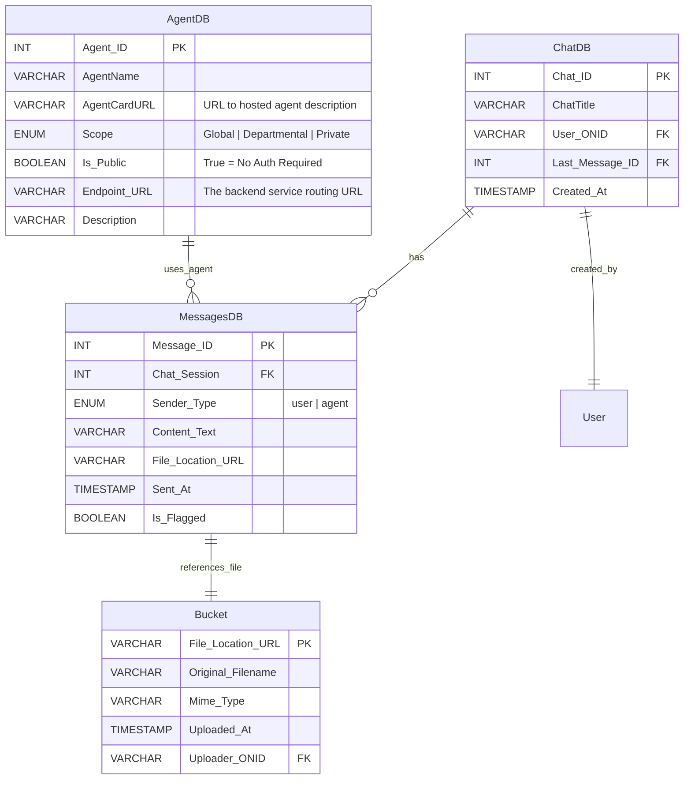

```mermaid
erDiagram
    %% ENTITIES
    ChatDB {
        INT Chat_ID PK
        VARCHAR ChatTitle
        VARCHAR User_ONID FK
        INT Last_Message_ID FK
        TIMESTAMP Created_At
    }

    MessagesDB {
        INT Message_ID PK
        INT Chat_Session FK
        ENUM Sender_Type "user | agent"
        VARCHAR Content_Text
        VARCHAR File_Location_URL
        TIMESTAMP Sent_At
        BOOLEAN Is_Flagged
    }

    AgentDB {
        INT Agent_ID PK
        VARCHAR AgentName
        VARCHAR AgentCardURL "URL to hosted agent description"
        ENUM Scope "Global | Departmental | Private"
        BOOLEAN Is_Public "True = No Auth Required"
        VARCHAR Endpoint_URL "The backend service routing URL"
        VARCHAR Description
    }

    Bucket {
        VARCHAR File_Location_URL PK
        VARCHAR Original_Filename
        VARCHAR Mime_Type
        TIMESTAMP Uploaded_At
        VARCHAR Uploader_ONID FK
    }

    %% RELATIONSHIPS
    ChatDB ||--o{ MessagesDB : has
    MessagesDB ||--|| Bucket : references_file
    AgentDB ||--o{ MessagesDB : uses_agent
    ChatDB ||--|| User : created_by

```
