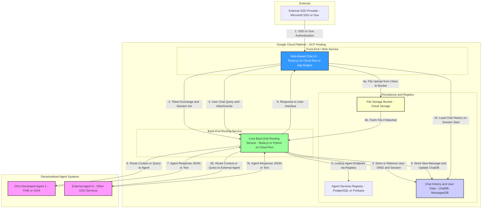

```mermaid
graph TD
    %% ==============================
    %% EXTERNAL AUTH SYSTEMS
    %% ==============================
    subgraph External
        A["External SSO Provider - Microsoft SSO or Duo"]
    end

    %% ==============================
    %% GCP HOSTING ARCHITECTURE
    %% ==============================
    subgraph GCP_Hosting["Google Cloud Platform - GCP Hosting"]
        direction LR

        subgraph FrontEnd["Front-End / Web Service"]
            H["Web-Based Chat UI - React.js on Cloud Run or App Engine"]
        end

        subgraph BackEnd["Back-End Routing Service"]
            M["Core Back-End Routing Service - Node.js or Python on Cloud Run"]
        end

        subgraph Persistence["Persistence and Registry"]
            K["Agent Services Registry - PostgreSQL or Firebase"]
            F["Chat History and User Data - ChatDB, MessagesDB"]
            O["File Storage Bucket - Cloud Storage"]
        end
    end

    %% ==============================
    %% DECENTRALIZED AGENT SYSTEMS
    %% ==============================
    subgraph DecentralizedAgents["Decentralized Agent Systems"]
        J["OSU-Developed Agent 1 - FAIE or GOA"]
        L["External Agent N - Other OSU Services"]
    end

    %% ==============================
    %% FLOW: AUTHENTICATION
    %% ==============================
    A -->|1. SSO or Duo Authentication| H
    H -->|2. Token Exchange and Session Init| M
    M -->|3. Store or Retrieve User ONID and Session| F

    %% ==============================
    %% FLOW: USER INTERACTION
    %% ==============================
    H -->|4. User Chat Query and Attachments| M
    H -->|4a. File Upload from Client to Bucket| O
    O -->|4b. Fetch File if Attached| M
    M -->|5. Lookup Agent Endpoint via Registry| K

    %% ==============================
    %% FLOW: AGENT ROUTING
    %% ==============================
    M -->|6. Route Context or Query to Agent| J
    M -->|6b. Route Context or Query to External Agent| L
    J -->|7. Agent Response JSON or Text| M
    L -->|7b. Agent Response JSON or Text| M
    M -->|8. Response to User Interface| H

    %% ==============================
    %% FLOW: PERSISTENCE
    %% ==============================
    M -->|9. Store New Message and Update ChatDB| F
    H -->|10. Load Chat History on Session Start| F

    %% ==============================
    %% STYLES
    %% ==============================
    style H fill:#39f,stroke:#333,stroke-width:2px,color:#fff
    style M fill:#9f9,stroke:#333,stroke-width:2px
    style J fill:#f9f,stroke:#333,stroke-width:2px
    style L fill:#f9f,stroke:#333,stroke-width:2px
    style F fill:#ccf,stroke:#333,stroke-width:2px
    style O fill:#ffc,stroke:#333,stroke-width:2px
```
